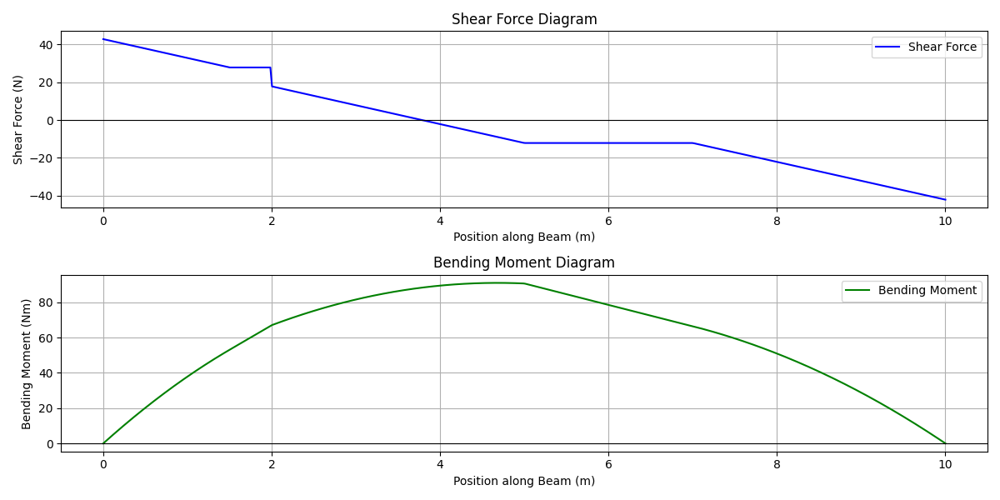

# SFD & BMD Generator

A web-based application to generate Shear Force Diagrams (SFD) and Bending Moment Diagrams (BMD) for **simply supported beams** subjected to:
- Point Load (PL)
- Uniformly Distributed Load (UDL)
- Two Uniformly Varying Loads (UVL)

This project was developed as part of a Mechanical Engineering course assignment using **Python (Flask)** for backend and **HTML/CSS** for frontend.

---

## 🔧 Features

- Calculates support reactions for a simply supported beam
- Supports input for:
  - Single Point Load
  - One UDL (Uniformly Distributed Load)
  - Two UVLs (Uniformly Varying Loads)
- Dynamically generates:
  - Shear Force Diagram (SFD)
  - Bending Moment Diagram (BMD)
- Visual outputs plotted using Matplotlib

---

## 🖥️ Tech Stack

- **Frontend:** HTML, Internal CSS
- **Backend:** Flask (Python)
- **Visualization:** Matplotlib, NumPy

---

## 📷 Sample Output

> Once inputs are submitted, the app generates plots like this:



---

## Run Locally
# Clone the repository
```bash
git clone https://github.com/whyom17/SFD-BMD-Calculator.git
```
# Navigate into the directory
```bash
cd repo
```
# Run the app
```bash
python app.py
```
# Open your browser and visit:
```bash
http://127.0.0.1:5000/
```

## Project Structure
```text 
  beam-sfd-bmd-generator/ 
  ├── app.py # Main Flask backend script 
  ├── templates/ 
  │ └── index.html # HTML form for input 
  ├── static/ 
  │ └── beam_analysis_graph.png # Output plot image (generated dynamically) 
  ├── README.md # Project documentation (this file)
```
💡 Note: beam_analysis_graph.png is created dynamically when the user submits input on the form.

Make sure you have Python installed along with the following packages:
```bash
pip install flask matplotlib numpy
```
